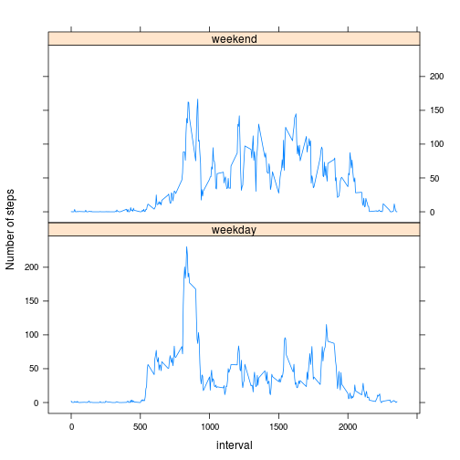

# Reproducible Research: Peer Assessment 1

This report has been submitted towards the Coursera Reproducible Research course; week 2. It demonstrates basic understanding of literate programming using knitr.

## Loading and preprocessing the data


```r
activity <- read.csv(unzip("activity.zip"), colClasses=c("numeric", "Date", "numeric"))
# check out the data and make sure classes imported as intended:
str(activity)
```

```
## 'data.frame':	17568 obs. of  3 variables:
##  $ steps   : num  NA NA NA NA NA NA NA NA NA NA ...
##  $ date    : Date, format: "2012-10-01" "2012-10-01" ...
##  $ interval: num  0 5 10 15 20 25 30 35 40 45 ...
```

## What is mean total number of steps taken per day?

For this part of the assignment, we will ignore the missing values in the dataset.

Make a histogram of the total number of steps taken each day:


```r
p <-aggregate(activity$steps ~ activity$date, activity, sum, na.rm=TRUE)
hist(p[,2], breaks = 10, xlab = "Steps", ylab = "Days", main = "Histogram of steps taken per day", col = "blue")
```

 

Calculate and report the mean and median total number of steps taken per day:

The mean:

```r
mean(p[,2], na.rm=TRUE)
```

```
## [1] 10766
```
The median:

```r
median(p[,2], na.rm=TRUE)
```

```
## [1] 10765
```

## What is the average daily activity pattern?

Make a time series plot (i.e. type = "l") of the 5-minute interval (x-axis) and the average number of steps taken, averaged across all days (y-axis)

```r
q <-aggregate(activity$steps ~ activity$interval, activity, mean, na.rm=TRUE)
plot(q[,1],q[,2], type="l", xaxt="n", xlab = "Interval number (5 minute intervals from 0000 hours to 2355)", ylab = "Average number of steps", main="Average number of steps per interval across all days")
axis(1, at = seq(0000, 2400, by = 100))
```

 

Which 5-minute interval, on average across all the days in the dataset, contains the maximum number of steps?

```r
s <- which.max(q[,2])
# This is the interval number:
q[s,1]
```

```
## [1] 835
```

It would appear that our subject is, on average, very active around 0835 in the morning!

## Imputing missing values

We note that there are a number of days/intervals where there are missing values (coded as NA). The presence of missing days may introduce bias into some calculations or summaries of the data. In this section we will investigate the extent to which these missing values may or may not be impacting our summaries.

Here we calculate and report the total number of missing values in the dataset (i.e. the total number of rows with NAs):

```r
sum(!complete.cases(activity))
```

```
## [1] 2304
```

For exploratory purposes, we will impute the missing values by inserting the average value for that time interval into the missing "NA" locations.

Here we create a new dataset that is equal to the original dataset but with the missing data filled in.


```r
# Label q columns properly
colnames(q) <- c("interval2", "avgsteps")
# Combine original activity data with averages in q:
activity2 <- cbind(activity, q$avgsteps)
colnames(activity2) <- c("steps", "date", "interval", "avgsteps")
# Identify which rows have missing "steps" data
my.na <- is.na(activity2$steps)
# Impute (bring over) the average value for that time interval across the whole data set
activity2$steps[my.na] <- round(activity2$avgsteps[my.na], 2)
```


Now we will make a histogram of the total number of steps taken each day calculating and reporting the mean and median total number of steps taken per day, just as we did at the beginning. 

We want to know if these values differ from the estimates from the first part of the assignment. What was the impact of imputing missing data on the estimates of the total daily number of steps?


```r
t <-aggregate(activity2$steps ~ activity2$date, activity2, sum, na.rm=TRUE)
hist(t[,2], breaks = 10, xlab = "Steps", ylab = "Days", main = "Histogram 2 of steps taken per day", col = "blue")
```

 

Again, we will calculate and report the mean and median total number of steps taken per day:

The mean:

```r
mean(t[,2], na.rm=TRUE)
```

```
## [1] 10766
```
The median:

```r
median(t[,2], na.rm=TRUE)
```

```
## [1] 10766
```

The conclusion we can draw is that imputing the missing values has not had a significant impact on the summary values of our data. The histogram retains its shape and merely reflects the increase in the frequency of average values in the dominant bin. The mean of average values is identical and the median has incremented slightly to match it. It is logical that the median would converge on the mean given that all the imputed values were averages from accross the data.

One question that remains to be asked is whether or not the activity pattern varies significantly on weekends versus weekdays. If it does, there is an opportunity to further refine our imputation values to match the time of week.

## Are there differences in activity patterns between weekdays and weekends?

The first task is to recreate the average daily activity pattern work from above, but using the filled in data set and separating out the weekdays from the weekends. The following code computes and plots the separate activity patterns:


```r
# Let's identify our weekdays
activity2$weekday <- weekdays(activity2$date)
# Let's decide if they are weekday or weekend
workdays <- c("Monday", "Tuesday", "Wednesday", "Thursday", "Friday")
for (i in 1:nrow(activity2)) {
  ifelse(activity2[i,][5] %in% workdays, activity2[i,6] <- "weekday", activity2[i,6] <- "weekend" )
}
colnames(activity2)[6] <- "week"
# Subset and and calculate the mean for each inteval.
weekdays <- subset(activity2, week == "weekday")
weekends <- subset(activity2, week == "weekend")
v <-aggregate(steps ~ interval, weekdays, mean)
w <-aggregate(steps ~ interval, weekends, mean)
# Plot the results
layout(rbind(1,2))
par(mar=c(0,4,4,2))
plot(v[,1],v[,2], type="l", xaxt="n",  xlab="",ylab="")
title("Weekdays", line = -1)
par(mar=c(4,4,0,2))
plot(w[,1],w[,2], type="l", xaxt="n",  xlab="",ylab="")
title("Weekends", line = -1)
axis(1, at = seq(0000, 2400, by = 100))
```

 

There is a clear difference in activity patterns between weekdays and weekends. This may be sufficient to consider imputing the missing data based on a typical weekday or weekend. What do you think?
